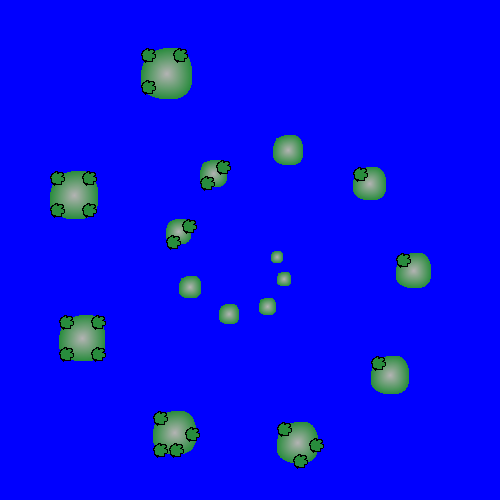

# Teoria kompilacji i kompilatory 2024/2025
## Dokumentacja dla użytkownika końcowego
## **MapS**

### Kinga Kowal
### Paweł Knot
### Jarosław Klima

<div style="page-break-after: always;"></div>

# Spis treści

* [Wprowadzenie](#wprowadzenie)
* [Instalacja](#instalacja)
    * [Wymagania](#wymagania)
    * [Sposób instalacji](#sposób-instalacji)
    * [Użycie języka](#użycie-języka)
* [Przegląd języka](#przegląd-języka)
  * [Główne cechy](#główne-cechy)
  * [Typy danych](#typy-danych)
  * [Operacje arytmetyczne](#operacje-arytmetyczne)
  * [Inne wyrażenia](#inne-wyrażenia)
  * [Sposoby korzystania z języka](#sposóby-korzystania-z-języka)
    * [Deklaracja zmiennych](#deklaracja-zmiennych)
    * [Instrukcje Przypisania](#instrukcje-przypisania)
    * [Instrukcje warunkowe](#instrukcje-warunkowe)
    * [Pętle](#pętle)
    * [Funkcje](#funkcje)
    * [Pojedyncza wyspa](#pojedyncza-wyspa)
    * [Wiele wysp](#wiele-wysp)
    * [Deklaracja Land z funkcjami](#deklaracja-land-z-funkcjami)
  

<div style="page-break-after: always;"></div>

# Wprowadzenie

<!--  -->
<p align="center">
  
</p>

MapS to język programowania, który służy do tworzenia map. Język posiada wbudowane typy danych które zostały zaprojektowane pod takim kątem aby maksymalnie ułatwić użytkownikowi pracę przy tworzeniu map.

MapS oprócz swoich specjalistycznych aspektów, posiada również szereg funkcjonalności które umożliwiają rozwiązywanie ogólnych problemów programistycznych.

<div style="page-break-after: always;"></div>

# Instalacja

Aby korzystać z języka MapS należy spełnić podane wymagania oraz wykonać następujące czynności:

## Wymagania:

1. **Python (+3.8)**
2. **Git**

## Sposób instalacji:
1. Otwórz terminal.
2. Sklonuj repozytorium używając komendy:
```bash
git clone https://github.com/pknot212121/MapS.git
```
3. Przejdź do folderu:
```bash
cd MapS\python
```
4. Zainstaluj wymagania:
```bash
pip install -r requirements.txt
```
5. Skopiuj ścieżkę folderu zawierającego skrypt, np:
```
C:\Users\TwojaNazwa\Maps\python
```
6. Dodaj ścieżkę do zmiennej środowiskowej **PATH**.

## Użycie języka:
Uruchamiaj pliki z rozszerzeniem .map używając komendy MapS:
```bash
MapS krakow.map
```

<div style="page-break-after: always;"></div>

# Przegląd języka

## Główne cechy
* Wbudowane typy geograficzne: *Point, Height, Land, Lake, River*
* Możliwość tworzenia własnych funkcji
* Warunkowe instrukcje sterujące *if* oraz pętle *repeat, while*
* Wbudowane funkcje tworzące obiekty *Land*: *Circle, RandomLand, Square*

## Typy danych
Proste:
* int - liczba całkowita,
* double - liczba zmiennoprzecinkowa,
* bool - wartość logiczna,
* string - ciąg znaków
  
Złożone:
* List\<T\> - lista obiektów typu T,
* Point - Punkt w przestrzeni dwuwymiarowej *(double, double)*,
* Height - Złożony obiekt wyrażający: położenie szczytu, wartości wysokości, stromości szczytu *(Point, double, double)*,
* Land - Obiekt wyspy zadeklarowany punktem oraz funkcją obwodu,
* River - rzeka wyrażona miejscem źródła *(Point)*,
* Lake - obiekt jeziora, deklarowany w podobny sposób jak obiekty typu *Land*

## Operacje arytmetyczne
* = | != | > | < | >= | <= - porównanie (np. x = 5)
* \+ | \- - dodawanie i odejmowanie (np. a + b)
* \* | \ mnożenie i dzielenie (np. x * 6)
* ^ | ? potęgowanie i pierwiastkowanie (np. x^3)
* ^^ - potęgowanie kwadratowe (np. x^^)
* ?? - pierwiastek kwadratowy (np. a??)

## Inne wyrażenia
* not | and | or - operacje logiczne
* sin() | cos() | tg() | ctg() - funkcje trygonometryczne (np. sin(x))
* (type) expression - rzutowanie typów (np. (int) x)
* parent::...::IDENTIFIER - dostęp do zmiennej w scopie nadrzędnym (np. parent::x)

## Sposoby korzystania z języka

### Deklaracja zmiennych
Deklaracja zmiennych odbywa się przy użyciu słowa kluczowego **is**, należy mieć na uwadze poprawność podawanego typu zmiennej.
```MapS
int x is 10;
Point p is (3, 5);
List<int> numbers is [1, 2, 3];
Land terrain is (3, 5) with perimeter is Circle(10), height is (x, 10, 10);
```

### Instrukcje Przypisania
Zmienna
```MapS
x is 42;
```

Pole punktu
```MapS
p.x is 10;
p.y is 12;
```

Lista
```MapS
numbers.add(5);
numbers[0] is 10;
```

### Instrukcje warunkowe
Korzystanie z instrukcji warunkowych wymaga użycia słowa kluczowego **if**, opcjonalnie możemy użyć również **eif, else**.
```MapS
if (x > 10) do {
    print("Liczba większa od 10");
} eif (x < -10) do {
    print("Liczba mniejsza od -10");
} else do {
    print("Liczba większa od -10 i mniejsza od 10");
}
```

### Pętle
Pętla **repeat** pozwala użytkownikowi wykonać operację określoną ilość razy, ponadto instrukcja repeat posiada dwa warianty **(default, from to)**.

wariant **default**:
przekazujemy do instrukcji repeat identyfikator iteratora oraz liczbę całkowitą *n*. W tym wariancie instrukcji, pętla wykona się n razy, a iterator będzie przyjmować wartości z zakresu [0,1,...,n-1]. 
(Jeśli n < 1 pętla nie zostanie uruchomiona)
```MapS
repeat j 5 {
    print(j);
}
```
wariant **from to**:
Oprócz identyfikatora iteratora do instrukcji przekazujemy ponadto dwie wartości całkowite, pierwszą po słowie kluczowym **from** a druga następującą po **to**. Pętla w tym wariancie wykona się |from - to| razy, a wartość iteratora będzie przyjmować wartości z zakresu [from,...,to-1] dla to > from lub [from,...,to+1] dla from > to. (jeśli wartości from oraz to są sobie równe, pętla nie zostanie uruchomiona)
```MapS
repeat with j from 12 to 42 {
    print(j);
}
```

Słowo kluczowe **while** również umożliwia użytkownikowi tworzenie pętli w swoim programie.
```MapS
int counter is 0;
while (counter < 3) do {
    print(counter);
    counter is counter + 1;
}
```

### Funkcje
Użytkownik może definiować własne funkcję używając słowa kluczowego **function**, jeśli funkcja zwraca typ inny niż *void* należy go podać poprzedzając ciało funkcji po znaku "**:**".
```MapS
function max(int a, int b) : int {
    if (a > b) do {
        return a;
    }
    else do{
        return b;
    }
}

function sayHello() {
    print("Hello!");
}
```

Aby skorzystać ze zdefiniowanej funkcji, należy wywołać ją podając jej nazwę i przekazując do niej wymagane parametry.
```MapS
sayHello();
int bigger = max(42,41);
print("max(42,41): "); 
print(bigger);
```
<div style="page-break-after: always;"></div>

# Przykłady użycia

## Pojedyncza wyspa
Aby wygenerować wyspę przy pomocy języka MapS, należy zdefiniować jak ma wyglądać obwód, czyli brzeg wyspy oraz miejsca szczytów gór równocześnie podając ich wysokość.

Definicja lini brzegowej:
```MapS
List<Point> islandPerimeter is [ (36, 70),  (44, 134), ... , (55, 52)];
```

Definicja szczytów gór (obiekt typu Height):
```MapS
List<Height> islandHeight is [ ((200,200), 30, 1), ... , ((50,120), 40, 1)];
```

Użytkownik może również dodać rzekę do swojej wyspy wyznaczając jej punkt początkowy (źródło), kierunek oraz opcjonalnie długość:
```MapS
River islandRiver is (0,0) to south for 100;
```
Może też samemu wybrać punkty skłądające się na rzekę:
```MapS
River riv is [(0,0),(100,100),(125,200)];
```

Aby poprawnie wygenerować wyspę trzeba ją odpowiednio zadeklarować, przekazując w konstruktorze, wcześniej zadeklarowane obiekty *islandPerimeter*, *islandHeight* oraz wektor przesunięcia środka wyspy.
```MapS
Land island is (0,-20) with perimeter is islandPerimeter, height is islandHeight;
```

Po uruchomieniu skryptu, generuje się wyspa:
```
MapS island.map
```
<p align="center">
  
</p>


Cały kod:
```MapS
List<Point> islandPerimeter is [ 
(36, 70),  (44, 134), (71, 179), (39, 236), (50, 267), (83, 275), (116, 263), (113, 286), (136, 287), (124, 318), (157, 318), (168, 307),(183, 307), (180, 294), (196, 288), (249, 283), (235, 271), (255, 260),(242, 244), (286, 236), (262, 222),(294, 200), (293, 179), (317, 155),(274, 151), (234, 191), (224, 179), (198, 183), (198, 163), (175, 163),(163, 136), (142, 195), (122, 193),  (114, 156), (90, 151), (98, 107), (78, 107), (79, 87), (87, 64), (78, 45), (55, 52)];

List<Height> islandHeight is [ ((200,200), 30, 1), ((50,90), 40, 1), ((70,220), 20, 1),((150,230), 20, 1), ((50,120), 40, 1)];

River islandRiver is (0,0);

Land island is (0,-20) with perimeter is islandPerimeter, height is islandHeight;
```

<div style="page-break-after: always;"></div>

## Wiele wysp
Przy pomocy pętli repeat możemy utworzyć wiele wysp, definiując obiekt Land przy każdym wykonaniu pętli:
```MapS
int a is 20;
double b is 20;
int isleCount is 16;
repeat with i isleCount {
    double k is i*2+10; 
    List<Point> perimeter0 is [(0,0), (0,k), (k,k), (k,0), (0,0)];
    List<Height> height0 is [ ((k/2,k/2), 10, 0)];
    double theta is i * 0.7;
    double r is a + b * theta;
    double x_coord is r * cos(theta);
    double y_coord is r * sin(theta);
    Land land0 is (0+x_coord,0+y_coord) with perimeter is perimeter0, height is height0;
}
```
W wyniku dostajemy archipelag w kształcie spirali:

<p align="center">
  
</p>

## Deklaracja Land z funkcjami
Deklaracja wyspy z gotowymi funkcjami obwodu:
```
List<Height> h is [((0, 0), 30, 1)];

Land terrain1 is (100, 100) with perimeter is Circle(50), height is h;

Land terrain2 is (-150, 50) with perimeter is Square(100, 2), height is h;

Land terrain3 is (0, -80) with perimeter is RandomLand(50, 0.6,3827), height is h;
```
Wyskość z funkcji:
```
function mountain(double x, double y) : double {
    return 50 - (x*x + y*y) * 0.01;
}

Land l is (0, 0) with perimeter is RandomLand(30, 0.5), height is mountain();
```
W RandomLand można podać seed, żeby za każdym razem nie tworzyły się różne lądy.

